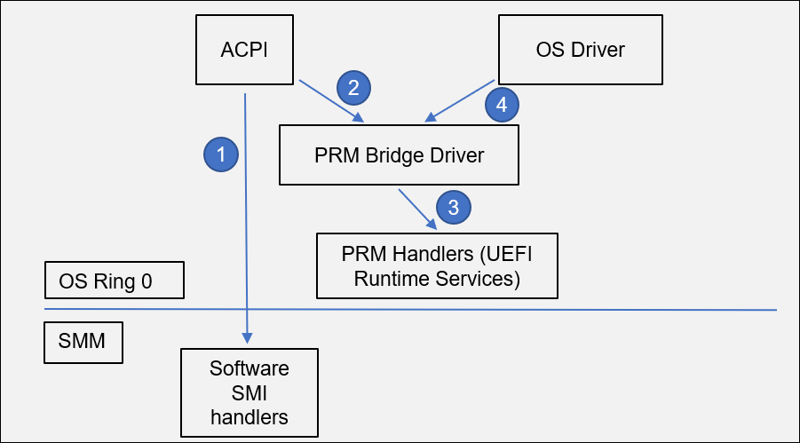
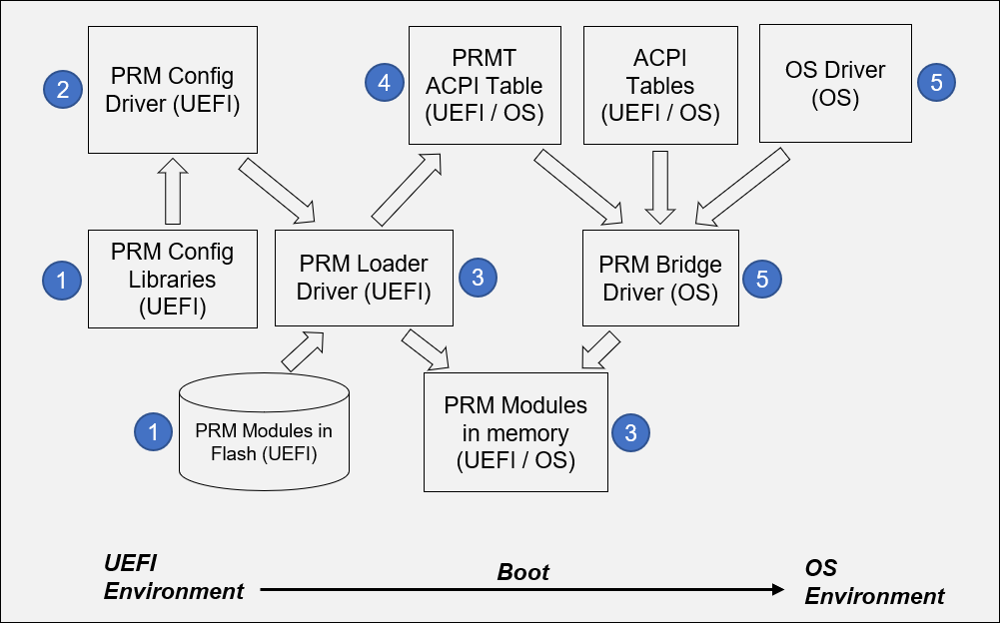
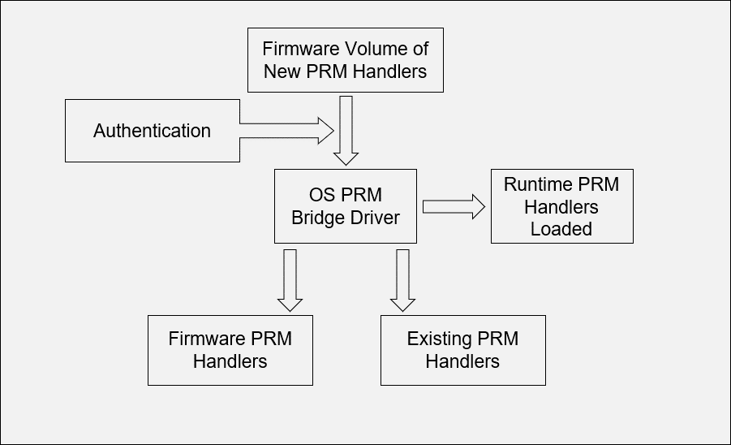
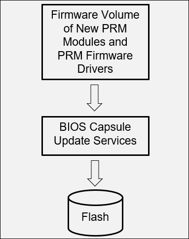

# **Platform Runtime Mechanism Handler Writer’s Guide**

**Revision 0.7.1**

**October, 2020**

**This document is in a rough draft state**

## **Acknowledgements**

Redistribution and use in source (original document form) and 'compiled'
forms (converted to PDF, epub, HTML and other formats) with or without
modification, are permitted provided that the following conditions are
met:

1.  Redistributions of source code (original document form) must retain
    the above copyright notice, this list of conditions and the
    following disclaimer as the first lines of this file unmodified.

2.  Redistributions in compiled form (transformed to other DTDs,
    converted to PDF, epub, HTML and other formats) must reproduce the
    above copyright notice, this list of conditions and the following
    disclaimer in the documentation and/or other materials provided with
    the distribution.

THIS DOCUMENTATION IS PROVIDED BY TIANOCORE PROJECT "AS IS" AND ANY
EXPRESS OR IMPLIED WARRANTIES, INCLUDING, BUT NOT LIMITED TO, THE
IMPLIED WARRANTIES OF MERCHANTABILITY AND FITNESS FOR A PARTICULAR
PURPOSE ARE DISCLAIMED. IN NO EVENT SHALL TIANOCORE PROJECT BE LIABLE
FOR ANY DIRECT, INDIRECT, INCIDENTAL, SPECIAL, EXEMPLARY, OR
CONSEQUENTIAL DAMAGES (INCLUDING, BUT NOT LIMITED TO, PROCUREMENT OF
SUBSTITUTE GOODS OR SERVICES; LOSS OF USE, DATA, OR PROFITS; OR BUSINESS
INTERRUPTION) HOWEVER CAUSED AND ON ANY THEORY OF LIABILITY, WHETHER IN
CONTRACT, STRICT LIABILITY, OR TORT (INCLUDING NEGLIGENCE OR OTHERWISE)
ARISING IN ANY WAY OUT OF THE USE OF THIS DOCUMENTATION, EVEN IF ADVISED
OF THE POSSIBILITY OF SUCH DAMAGE.

Copyright (c) Microsoft Corporation

Copyright (c) 2020, Intel Corporation. All rights reserved.

-------
## **Revision History**

| Revision    | Revision History                                                              | Date          |
|-------------|-------------------------------------------------------------------------------|---------------|
| 0.1         | Initial draft                                                                 | April 2020    |
| 0.7         | Added PRM direct call and populated initial code definitions.                 | July 2020     |
| 0.7.1       | Basic edits to 0.7 markdown formatting and content grammar.                   | October 2020  |


## **Table of Contents**

[**1. Introduction**](#1-introduction)

[**2. Overall Flows**](#2-overall-flows)

[2.1 Boot and Runtime Flows](#21-boot-and-runtime-flows)

[*--- 2.1.1 Boot Flow*](#211-boot-flow)

[*--- 2.1.2 OS Runtime PRM Handling Flow*](#212-os-runtime-prm-handling-flow)

[2.2 OS Runtime PRM Update Flow](#22-os-runtime-prm-update-flow)

[**3. Libraries Used by PRM Handlers**](#3-libraries-used-by-prm-handlers)

[3.1 Base Libraries](#31-base-libraries)

[3.2 I/O Libraries](#32-io-libraries)

[*--- 3.2.1 IO Lib*](#321-io-lib)

[*--- 3.2.2 High level IO Libs (PCI Lib, etc.)*](#322-high-level-io-libs-pci-lib-etc.)

[3.3 PRM Memory Allocation Library Instance](#33-prm-memory-allocation-library-instance)

[3.4 PRM Library Initialization](#34-prm-library-initialization)

[**4. Code Definitions**](#4-code-definitions)

[4.1 PRMT ACPI Table](#41-prmt-acpi-table)

[*--- 4.1.1 PRM\_HANDLER\_INFORMATION\_STRUCT*](#411-prm_handler_information_struct)

[*--- 4.1.2 PRM\_MODULE\_INFORMATION\_STRUCT*](#412-prm_module_information_struct)

[*--- 4.1.3 PRM \_ACPI\_DESCRIPTION\_TABLE*](#413-prm-_acpi_description_table)

[4.2 Static Information Exported by PRM Module](#42-static-information-exported-by-prm-module)

[*--- 4.2.1 PRM\_HANDLER\_EXPORT\_DESCRIPTOR\_STRUCT*](#421-prm_handler_export_descriptor_struct)

[*--- 4.2.2 PRM\_MODULE\_EXPORT\_DESCRIPTOR\_STRUCT*](#422-prm_module_export_descriptor_struct)

[4.3 Dynamic Information Reported through PRM Config Protocol](#43-dynamic-information-reported-through-prm-config-protocol)

[*--- 4.3.1 PRM\_CONTEXT\_BUFFERS*](#431-prm_context_buffers)

[*--- 4.3.2 PRM\_RUNTIME\_MMIO\_RANGES*](#432-prm_runtime_mmio_ranges)

[*--- 4.3.3 PRM\_MODULE\_CONTEXT\_BUFFER*](#433-prm_module_context_buffer)

[*--- 4.3.4 PRM\_CONFIG\_PROTOCOL*](#434-prm_config_protocol)

[*--- 4.4 PRM\_HANDLER function*](#44-prm_handler-function)

[4.5 PRM Module Entry Point](#45-prm-module-entry-point)

[**5. Code Samples**](#5-code-samples)

[5.1 ASL code that invokes a PRM call through OpRegion write](#51-asl-code-that-invokes-a-prm-call-through-opregion-write)

[5.2 PRM Handler Skeleton Codes](#52-prm-handler-skeleton-codes)

[**6. Discussions**](#6-discussions)

## **Figures**

[Figure 1‑1 PRM Overall Architecture](##figure-1-1-prm-overall-architecture)

[Figure 2‑1 PRM Components](#figure-2-1-prm-components)

[Figure 2‑2 PRM Update in Memory](#figure-2-2-prm-update-in-memory)

[Figure 2‑3 PRM Update in Flash](#figure-2-3-prm-update-in-flash)

## **Tables**

[Table 2‑1 Example map of PRM Modules and PRM Handlers](#table-2-1-example-map-of-prm-modules-and-prm-handlers)

---------

# **1. Introduction**

Platform Runtime Mechanism (PRM) is a runtime firmware environment that addresses some of the existing problems
with SMM:

- SMM code has unlimited privileges to system hardware and runs in a black box that cannot be audited.
  Viewed as a vulnerability by the OS.

- SMM impacts system performance by requiring all CPUs to enter SMM while an SMM event happens.

### Figure 1-1 PRM Overall Architecture


* 1: The traditional way:
  * ACPI calls software SMI

* 2 / 3: The PRM way through ACPI call:
  * ACPI call is captured by a PRM Bridge Driver, and the PRM Bridge Driver calls into PRM Handlers (similar to UEFI
    Runtime Services) on behalf of the ACPI call, and returns the result to ACPI.

* 4 / 3: The PRM way through direct call by driver:
  * Instead of calling ACPI, an OS driver can directly call a PRM handler through the PRM Bridge Driver.

This document describes the implementation details in the PRM infrastructure useful to understand when writing PRM
Modules and PRM Handlers. Please refer to the PRM specification (\*\*TBD: link) for a formal definition of the PRM
interface between BIOS and OS.

# **2. Overall Flows**

## **2.1 Boot and Runtime Flows**

This section describes the BIOS and OS components involved in the system boot flow to establish a PRM environment.

### Figure 2-1 PRM Components


### **2.1.1 Boot Flow**

From BIOS to OS, the following actions are taken for PRM to be ready for use:

*1.*  A PRM Module is a PE image that provides a set of PRM Handlers. PRM Modules are stored as part of the system
BIOS in the system flash’s BIOS region.

    1.  A PRM Module is agnostic of the design of the host BIOS.

    2.  In order for a PRM Module to collect environment information from the host BIOS at boot time, a PRM Config
        Library must be implemented for the PRM Module.

        1.  The PRM Config Library acts a bridge between the PRM Module and the host BIOS. The implementation of
            the PRM Config Library depends on the host BIOS.

    3.  Multiple PRM Config Libraries (each representing a PRM Module) are linked into the PRM Config Driver, which is
        the controller driver that manages each PRM Module’s platform configurations.

    4.  PRM Config Libraries are implemented as instances of NULL Library Classes in EDK II.

*2.*  At boot time, the host BIOS loads the PRM Config Driver.

    1.  Each PRM Config Library linked to the PRM Config Driver takes the following actions:

        1.  Allocates a Platform Configuration Buffer.

            -   Collects Platform Configuration data from the host BIOS and stores the data in a Platform Configuration
                Buffer per the format defined by the PRM Handler's implementation. Platform configuration data is
                background information needed by a PRM Handler to perform its work.

            -   The Platform Configuration Buffer also includes any runtime memory space needed by the PRM Module.

        2.  Allocates a Parameter Passing Buffer for each PRM Handler to store parameters of a PRM Handler call by ACPI.

            -   Updates an OpRegion in ACPI table to point to the corresponding Parameter Passing Buffer for each PRM
                Handler in this PRM Module.

        3.  Composes a list of Runtime MMIO Ranges that need to have virtual addresses made accessible to a PRM Handler
            at OS runtime.

            -   The list of actual MMIO Ranges needed by a PRM Module may depend on the underlying hardware
                configuration, e.g., number of CPU Sockets. So there needs to be a defined contract between the PRM
                Config Lib and the PRM Module on how the MMIO Ranges list is organized (including order of elements,
                and length of list) per system configuration.

        4.  Produces the PRM Config protocol for this PRM Module, providing information on Platform Configuration
            Buffers, Parameter Passing Buffers, Runtime MMIO Ranges, and the PRM Module GUID.

    2.  The PRM Config Driver registers an End Of DXE event handler where the PRM Config Driver will collect Platform
        Config Buffers, Parameter Passing Buffers, and Runtime MMIO Ranges from all PRM Config Protocol instances.

    3.  The PRM Config Driver registers a Virtual Address Change event handler where the PRM Config Driver will convert
        the addresses collected in an End Of DXE event handler to virtual addresses.

    4.  NOTE: Virtual address conversions in (3) can be removed once the OS PRM Bridge Driver is implemented to support
        these conversions.

*3.*  The host BIOS loads the PRM Loader Driver.

    1.  The PRM Loader Driver registers an End Of DXE event handler, where the PRM Loader Driver will:

        1.  Discover PRM Modules from the flash.

        2.  Extract static PRM Module Information and PRM Handler Information from each PRM Module.

            -   Static PRM Module Information and PRM Handler Information are exported through PE image export table
                by the PRM Module.

            -   Static PRM Module information includes the PRM Module GUID (TBD: and Module Meta Data).

            -   Static PRM Handler information includes the PRM GUIDs and PRM Handler functions exposed by this
                PRM Module.

        3.  Loop through PRM Config protocols to find out each PRM Module’s MMIO Ranges, Platform Config Buffer, and
            the Module’s PRM Handlers’ Parameter Passing Buffers

*4.*  The PRM Loader Driver produces and publishes PRMT ACPI Table with the information collected in the above steps.

*5.*  The OS boots and the PRM Bridge Driver plays a central role in the PRM runtime environment (see the next
      section on OS runtime PRM handling flow).

### Table 2-1 Example Map of PRM Modules and PRM Handlers

| PRM Module   | PRM Handler   | Supported PRM GUIDs |
|--------------|---------------|---------------------|
| PRM Module 1 | PRM Handler 1 | PRM GUID 1          |
| PRM Module 2 | PRM Handler 2 | PRM GUID 2          |
|              | PRM Handler 3 | PRM GUID 3          |

### **2.1.2 OS Runtime PRM Handling Flow**

*1.*  ACPI code (AML) prepares PRM call parameters by accessing the fields in the Operation Region (OpRegion)
      representing the Parameter Passing Buffer.

    1.  An OS driver performing direct call will prepare parameters in a memory buffer allocated by the OS driver.

*2.*  ACPI code makes a PRM call by writing the PRM handler GUID to the PRM OpRegion.

    1.  An OS driver making direct call calls into an interface exposed by the PRM Bridge Driver.

*3.*  The PRM Bridge Driver receives the PRM call from ACPI or OS Driver, and:

    1.  If there is a PRM Handler supporting the PRM GUID, calls the PRM Handler with following info as input
        parameters.

        1.  PRM Parameter Passing Buffer

        2.  PRM Handler Context including

            1.  Platform Config Buffer

            2.  MMIO Ranges

    2.  If there is no PRM Handler supporting the PRM GUID, an error is returned.

*4.*  A PRM Handler.

    1.  Handles the PRM call based on input information in:

        1.  PRM Parameter Passing Buffer

        2.  Platform Config Buffer

        3.  Virtual addresses for the MMIO Ranges

    2.  Fills output parameters in the Parameter Passing Buffer

    3.  Returns status code (SUCCESS or FAILURE)

*5.*  PRM Bridge Driver returns to the caller.

*6.*  The caller (ACPI code or OS driver) handles the results from the Parameter Passing Buffer.

## **2.2 OS Runtime PRM Update Flow**

### Figure 2-2 PRM Update in Memory


### Figure 2-3 PRM Update in Flash


OS Runtime PRM Handler Update Flow is described as follows:

*1.*  OS receives a Firmware Volume (or a container of other format) containing a set of new PRM Modules.

    1.  This set of new PRM Modules must be updated in one batch.

    2.  The meta data of the Firmware Volume (and/or the meta data in the PRM Modules themselves) indicate
        (directly or indirectly) the target environment, such as the version of host BIOS, the version of host
        OS, and the versions of other PRM Modules that are known to be compatible with the new PRM Modules.

*2.*  OS evaluates all of the new PRM Modules by:

    1.  Authenticating the new PRM Modules and evaluating their meta data against metadata of existing PRM Modules.

        1.  The new PRM Modules can support new PRM Handler GUIDs that are not already supported on the system.

        2.  For PRM GUIDs already supported on the system, only when the set of PRM GUIDs supported by the new set of
            PRM Handlers exactly match ALL of the PRM GUIDs supported by a set of existing PRM Modules can the
            update proceed.

*3.*  If the evaluation passes, OS notifies the PRM Bridge Driver about the new PRM Modules.

*4.*  The PRM Bridge Driver stages the new PRM Modules.

    1.  The PRM Bridge Driver loads the new PRM Modules.

*5.*  The PRM Bridge Driver checks the existing PRM Module's update status.

    1.  Once all PRM Modules affected by this update are updatable, the PRM Bridge Driver enables the new
        PRM Module immediately before the next PRM call after this condition is true.

    2.  The PRM Bridge Driver maintains the new set of PRM Modules.

*6.*  When the OS decides to persist the new PRM Modules to BIOS, the OS calls Capsule Update Service to persist the
      new PRM Modules to the PRM Firmware Volume in BIOS. These new PRM Modules will be managed by the PRM Config
      Driver and PRM Loader after the system reboots.

    1.  Full BIOS update is preferred. In this case, OS will also persist a new PRM Config Driver that is linked
        with PRM Config Libs for all of the old and new PRM Handlers.

    2.  TBD if not doing a full BIOS update, Module level (fine grained) PRM Config Drivers should be provided for
        the new PRM Modules.

        1.  These Module level PRM Config Drivers must have unique GUIDs such that they can coexist in the BIOS.

# **3. Libraries Used by PRM Handlers**

Unlike traditional UEFI Modules, PRM Handlers must not access any UEFI infrastructure. The EDK II code base’s library
infrastructure should be used with care to avoid inadvertent references to UEFI infrastructure.

On the other hand, PRM Handlers place unique requirements on libraries. For example, PRM Handlers might need to access
a MMIO library that has virtual address mapping incorporated, but the access method must be independent of the
mapping mechanisms in UEFI or the OS.

To avoid complexities, library instances with constructors should be avoided.

## **3.1 Base Libraries**

The following library instances in MdePkg in EDK II can be used directly in a PRM Module:

1.  `BaseLib`

2.  `BaseMemoryLib`

3.  `BasePrintLib`

## **3.2 I/O Libraries**

### **3.2.1 IO Lib**

EDK II’s MdePkg’s `BaseIoLibIntrinsic` library instance CANNOT be used directly in a PRM Module – an MMIO address has to
be looked up and translated into virtual address before being passed to this IO library instance.

To simplify the usage of `IoLib` at OS runtime, a new `PrmIoLibIntrinsic` library instance should be implemented that
accepts physical addresses and translates them into virtual addresses, where the differences from `BaseIoLibIntrinsic`
library instance are in IoLib.c:

1.  The `PrmIoLibIntrinsic` library instance checks `gVirtualAddressRangeList` and `gNumOfVirtualAddressRanges `global
    variables to translate an MMIO address from physical to virtual before accessing the location.

2.  `gVirtualAddressRangeList` and `gNumOfVirtualAddressRanges` global variables must be initialized once by PRM Module
    upon the first PRM call, using the MMIO Ranges passed from the PRM Bridge Driver.

    1.  There is a hard dependency on physical to virtual mappings being constant during OS runtime, which should be
        true per UEFI spec.

    2.  `PrmIoLibIntrinsic` can maintain a hash table to speed up virtual address lookups.

### **3.2.2 High level IO Libs (PCI Lib, etc.)**

High level IO libraries can be provided to PRM Handlers.

A High level IO library needs mapping info from high level concepts to low level addresses. For example:

-   Mapping form PCI Bus / Dev / Func to MMIO addresses.

-   Mapping from a register set in a CPU Socket to the actual MMIO addresses.

The format of these mappings can be defined. The PRM Config Library can fill the contents of these mappings in the
PRM Config Buffer, and the PRM Handler can store the pointers to these mappings to some global variables to be
consumed by the High Level IO library.

## **3.3 PRM Memory Allocation Library Instance**

Needs to implement a memory allocation library instance that manages the runtime memory allocated in the Platform
Config Buffer.

The memory allocation library will consume global variables initialized with the base address and size of the runtime
memory buffer.

## **3.4 PRM Library Initialization**

As discussed above, PRM Library Instances will rely on some global variables being initialized to function properly.
A PRM Lib Init Library Class can be defined for this purpose. A PRM Lib Init function will accept Virtual Address info,
High Level IO Mapping Info, and Runtime Memory Info as input parameters, and initialize the global variables
accordingly.

# **4 Code Definitions**

The data type widths in this specification conform to section 2.3.1 of UEFI Specification, version 2.8. Data
(if not explicitly packed) are naturally aligned as described in section 2.3.1 of UEFI Specification, version 2.8.

To avoid duplication, this section points to the `PrmPkg` in EDK II Open Source Repo for data structure definitions.

The source codes with the comments are self explanatory. If not, we should fix the source codes.

## **4.1 PRMT ACPI Table**

PRMT ACPI table is the interface used by BIOS to communicate PRM information to OS.

### **4.1.1 PRM\_HANDLER\_INFORMATION\_STRUCT**

**Summary**

The PRM Handler Information structure describes a PRM Handler.

**Reference**

<https://github.com/tianocore/edk2-staging/blob/PlatformRuntimeMechanism/PrmPkg/PrmLoaderDxe/PrmAcpiTable.h>

### **4.1.2 PRM\_MODULE\_INFORMATION\_STRUCT**

**Summary**

The PRM Module Information structure describes a PRM Module.

**Reference**

<https://github.com/tianocore/edk2-staging/blob/PlatformRuntimeMechanism/PrmPkg/PrmLoaderDxe/PrmAcpiTable.h>

### **4.1.3 PRM \_ACPI\_DESCRIPTION\_TABLE**

**Summary**

The PRMT ACPI table is produced by BIOS and consumed by OS. The PRMT ACPI table contains information on PRM Modules
and PRM Handlers produced by the BIOS.

**Reference**

<https://github.com/tianocore/edk2-staging/blob/PlatformRuntimeMechanism/PrmPkg/PrmLoaderDxe/PrmAcpiTable.h>

## **4.2 Static Information Exported by PRM Module**

A PRM Module exports static information about the PRM Module and PRM Handlers. The PRM Loader parses these exported
static information while loading the PRM Module images.

### **4.2.1 PRM\_HANDLER\_EXPORT\_DESCRIPTOR\_STRUCT**

**Summary**

A PRM Handler Export Descriptor describes a PRM GUID and its PRM Handler’s function name.

**Reference**

<https://github.com/tianocore/edk2-staging/blob/PlatformRuntimeMechanism/PrmPkg/Include/PrmExportDescriptor.h>

### **4.2.2 PRM\_MODULE\_EXPORT\_DESCRIPTOR\_STRUCT**

**Summary**

A PRM Module Export Descriptor describes a PRM Module’s meta data, including the PRM Module’s GUID, PRM Platform GUID,
and a list of PRM Handler Export Descriptors.

**Reference**

[**https://github.com/tianocore/edk2-staging/blob/PlatformRuntimeMechanism/PrmPkg/Include/PrmExportDescriptor.h**](https://github.com/tianocore/edk2-staging/blob/PlatformRuntimeMechanism/PrmPkg/Include/PrmExportDescriptor.h)

## **4.3 Dynamic Information Reported through PRM Config Protocol**

PRM Config Protocol reports dynamic information on PRM Modules and PRM Handlers. PRM Config Library instances produce
the PRM Config Protocol instances. The PRM Loader enumerates the PRM Config Protocol instances to collect the dynamic
information.

### **4.3.1 PRM\_CONTEXT\_BUFFERS**

**Summary**

PRM Context Buffer describes a PRM Handler’s GUID and its corresponding Static Config Buffer and MMIO Ranges. This data
structure is used both in reporting PRM dynamic info at BIOS boot time, and in runtime PRM invocation (as a parameter
to the PRM function call).

**Reference**

[**https://github.com/tianocore/edk2-staging/blob/PlatformRuntimeMechanism/PrmPkg/Include/PrmContextBuffer.h**](https://github.com/tianocore/edk2-staging/blob/PlatformRuntimeMechanism/PrmPkg/Include/PrmContextBuffer.h)

### **4.3.2 PRM\_RUNTIME\_MMIO\_RANGES**

**Summary**

PRM Runtime MMIO Ranges describes the MMIO addresses accessed by a PRM Module. These address ranges need to be mapped
to virtual addresses at OS runtime.

**Reference**

[**https://github.com/tianocore/edk2-staging/blob/PlatformRuntimeMechanism/PrmPkg/Include/PrmMmio.h**](https://github.com/tianocore/edk2-staging/blob/PlatformRuntimeMechanism/PrmPkg/Include/PrmMmio.h)

### **4.3.3 PRM\_MODULE\_CONTEXT\_BUFFER**

**Summary**

PRM Module Context Buffer describes a PRM Module’s MMIO Ranges, ACPI Parameter Buffer, and Static Config Buffer.

**Reference**

[**https://github.com/tianocore/edk2-staging/blob/PlatformRuntimeMechanism/PrmPkg/Include/PrmContextBuffer.h**](https://github.com/tianocore/edk2-staging/blob/PlatformRuntimeMechanism/PrmPkg/Include/PrmContextBuffer.h)

### **4.3.4 PRM\_CONFIG\_PROTOCOL**

**Summary**

This protocol is produced by PRM Config Library to describe a PRM Module’s information. PRM Config Dxe driver collects
this information to feed to the PRM Loader Dxe driver to produce the PRMT ACPI table.

**Reference**

[**https://github.com/tianocore/edk2-staging/blob/PlatformRuntimeMechanism/PrmPkg/Include/Protocol/PrmConfig.h**](https://github.com/tianocore/edk2-staging/blob/PlatformRuntimeMechanism/PrmPkg/Include/Protocol/PrmConfig.h)

## **4.4 PRM\_HANDLER function**

**Summary**

This is the PRM Handler function called by the PRM Bridge Driver in response to a PRM call from ACPI.

**Reference**

[**https://github.com/tianocore/edk2-staging/blob/PlatformRuntimeMechanism/PrmPkg/Include/Prm.h**](https://github.com/tianocore/edk2-staging/blob/PlatformRuntimeMechanism/PrmPkg/Include/Prm.h)

## **4.5 PRM Module Entry Point**

**Summary**

TBD. This function is the main entry point to a PRM Module. This function is called by PRM Boot Loader at BIOS boot
time or by PRM Bridge Driver during PRM update at OS runtime. This function may be used to perform any initialization
work needed (e.g., library initializations).

**Prototype**

```c
typedef
VOID
(EFIAPI PRM_HANDLER_IMAGE_ENTRY_POINT) (
  xxx,
  xxx
  );
```

**Parameters**

**Description**

TBD. This function is the main entry point to a PRM Handler Image. This function is called by PRM Boot Loader at
BIOS boot time or by PRM Bridge Driver during PRM update at OS runtime.

# **5 Code Samples**

## **5.1 ASL code that invokes a PRM call through OpRegion write**

Please refer to:
[**https://github.com/tianocore/edk2-staging/blob/PlatformRuntimeMechanism/PrmPkg/PrmSsdtInstallDxe/Prm.asl**](https://github.com/tianocore/edk2-staging/blob/PlatformRuntimeMechanism/PrmPkg/PrmSsdtInstallDxe/Prm.asl)

## **5.2 PRM Handler Skeleton Codes**

Please refer to:
[**https://github.com/tianocore/edk2-staging/tree/PlatformRuntimeMechanism/PrmPkg/Samples**](https://github.com/tianocore/edk2-staging/tree/PlatformRuntimeMechanism/PrmPkg/Samples)

# **6 Discussions**

-   PRM Bridge Driver needs to lock PRM Module from being updated while a transaction (consisting of a series of
    related PRM Handler calls) is going on.

    -   Caller explicitly calls Lock() and Unlock() before and after a transaction.

-   Serialization of PRM Calls

    -   Bridge Driver always serializes all PRM calls.
